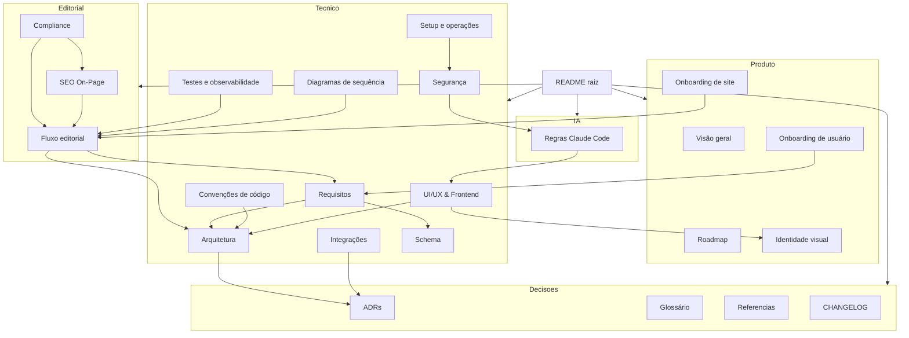

# Índice da documentação

Mapa de todos os documentos do Editorial Dashboard (COMPOST), por área. Ponto de entrada geral: [README.md](../README.md) da raiz.

## Produto

- [Visão geral](product/visao-geral.md) — o que é, objetivo, princípios, conceito central
- [Roadmap e escopo](product/roadmap.md) — fases 1–9, critério de sucesso
- [Identidade visual](product/identidade-visual.md) — nome, mockups, paleta de cores
- [Onboarding de site](product/onboarding-site.md)
- [Onboarding de usuário](product/onboarding-usuario.md)

## Editorial

- [Fluxo editorial](editorial/fluxo-editorial.md) — usuários/sites, produção com IA, revisão/publicação/relatórios
- [Compliance de conteúdo](editorial/compliance.md) — regras de qualidade/AdSense, elementos de um post
- [SEO On-Page & Checklist Editorial](editorial/seo.md) — checklist de otimização para busca (título, meta, links, imagens, canibalização)

## Técnico

- [Arquitetura](technical/arquitetura.md) — stack, padrão MVC, diretórios
- [Integrações](technical/integracoes.md) — Gemini, Nano Banana, WordPress, MySQL, Beekeeper, NotebookLM
- [Segurança](technical/seguranca.md) — política de credenciais, checklist de deploy
- [Credenciais privadas](technical/credenciais-privadas.md) — **local, fora do Git**
- [Requisitos e modelagem](technical/requisitos.md) — RF/RB, permissões, autenticação, estados
- [Schema de banco de dados](technical/schema.md)
- [Convenções de código](technical/padroes-de-codigo.md)
- [UI/UX & Frontend Standards](technical/ui-ux-frontend.md) — padrão de interface, UX e acessibilidade (WCAG 2.2 AA)
- [Testes e observabilidade](technical/testes-e-observabilidade.md)
- [Setup e operações](technical/setup-e-operacoes.md) — getting started completo, CI
- [Diagramas de sequência](technical/diagrama-sequencia.md)

## Governança de IA

- [Regras para o Claude Code](ai/regras-claude-code.md)

## Decisões e referências

- [ADRs](decisions/README.md)
- [Glossário](glossario.md)
- [Referências oficiais](referencias.md)
- [CHANGELOG](../CHANGELOG.md)

## Como os documentos se relacionam

> Renderiza como diagrama no GitHub/GitLab (suportam Mermaid nativamente). Se abrir num visualizador sem suporte a Mermaid, o bloco aparece como texto — a leitura ainda funciona, só não é visual.